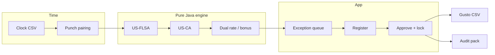

<p align="center">
  
</p>

<p align="center">
  <strong>Multi-tenant labor-compliance and earnings engine for independent outpatient clinic groups.</strong><br>
  Takes clock punches, applies FLSA + California wage-and-hour rules plus clinic pay structures, and exports a payroll-ready file the owner can defend.
</p>

<p align="center">
  
  
  
  
  
</p>

> [!IMPORTANT]
> **Calculation assistance, not legal advice.** You remain the employer of record. AegisPay does not remit taxes, file 941s, or move money. The California pack is **not counsel-reviewed**. Do not take a paid CA tenant until E&O is bound and `docs/READY_TO_SELL.md` is fully checked.

---

## Why this exists

Generic payroll (Gusto, ADP, QuickBooks) is good at tax filing and direct deposit. It is weak at the math that actually gets clinics fined:

| Problem clinics already have | What AegisPay does |
| --- | --- |
| California daily OT after 8, double-time after 12, seventh consecutive day | Cited earnings lines, not a spreadsheet cell |
| Missed / late / short meal and rest premiums | Attestation wins when it is worse for the employer |
| Hygienist dual rates in one day | Weighted regular rate, not “use the highest” |
| Production bonus true-up into overtime | Regular-rate recalculation with an explanation drawer |
| Excel the day before payday | Exception queue → approve → Gusto CSV |

AegisPay **sits in front of Gusto**. Clinic owners already pay payroll. They will also pay for the system that makes the hours Gusto is about to pay legally explainable.

**v1 verticals:** dental, PT, urgent care, veterinary. **v1 law packs:** US-FLSA + US-CA.

---

## What you will never find in v1

No EHR, patient scheduling, insurance billing, HRIS, benefits, 401(k), or in-house tax filing. No SSN, bank accounts, or driver’s licenses — clock CSVs that include those columns are rejected.

---

## How a payday works

```text
Clock CSV  →  pair punches  →  engine 0.2.0  →  exception queue
                                                    ↓
                         Gusto / generic CSV  ←  PAYROLL_APPROVE
                                                    ↓
                                         audit pack PDF (add-on)
```



Every earnings line carries `code`, `citation`, `formula`, and `narrative`. That is the sellable artifact.

---

## Demo (local seed)

Harbor Dental, **Group** plan, owner can approve payroll.

| | |
| --- | --- |
| Email | `owner@harbordental.example` |
| Password | `HarborDental!demo` |
| UI | http://localhost:5173 |
| API | http://localhost:8080/api/v1 |
| OpenAPI | http://localhost:8080/swagger-ui.html |

New signups start on a 14-day **Pilot** (1 location, 2 pay periods). There is no free-forever plan.

---

## Run it locally

**Need:** JDK **21**, Node 20+, Docker, Gradle 8+. Redis is optional locally (`aegispay.redis.required: false`).

```bash
# 1. Database
docker compose up -d postgres redis

# 2. API (local profile seeds Harbor Dental)
cd backend
SPRING_PROFILES_ACTIVE=local AEGISPAY_SEED=true gradle :app:bootRun

# 3. UI
cd ../frontend
npm install
npm run dev
```

The UI proxies `/api` to `http://localhost:8080`.

**Engine-only concierge CLI** (no Spring, no database):

```bash
cd backend
gradle :engine:run
```

---

## Repository map

```text
AegisPay/
├── backend/
│   ├── engine/     Pure Java. No Spring. No database. Golden tests live here.
│   └── app/        Spring Boot 3.3 modular monolith (platform, org, time, rules, payroll, billing)
├── frontend/       React 18 + TypeScript + Vite (office-manager UI, paper theme)
├── marketing/      One-page sales site
├── legal/          TOS / privacy / DPA outlines — still need a lawyer
├── runbooks/       Restore, JWT rotate, freeze tenant, replay pay run, Stripe replay
├── docs/           Security, calendar, ready-to-sell, risks
└── IMPLEMENTATION_STEPS.md   Scope lock and build order
```

Pay-run lifecycle:

`DRAFT → CALCULATED → EXCEPTIONS_PENDING → APPROVED → EXPORTED → LOCKED`

Recalculate is allowed until **APPROVED**. After that, unlock is dual-control: **PAYROLL_ADMIN** requests, a different **OWNER** confirms.

---

## Plans

| Plan | Price | Limits |
| --- | --- | --- |
| Pilot | $0 for 14 days, then convert | 1 location, 2 pay periods |
| Group | $299 / month | 5 locations, 80 employees, CA + FLSA |
| Network | $599 / month | 20 locations, 250 employees, second state pack |
| Audit Pack | $99 / run | Attorney-ready PDF with citations and punch appendix |

---

## Tests worth knowing

| Area | Where |
| --- | --- |
| DOL Fact Sheet overtime | `backend/engine/src/test/java/.../FlsaGoldenTest.java` |
| CA daily OT, dual rate, seventh day | `engine` tests + `EvaluationPipeline` |
| Forever fixtures | `backend/engine/src/test/resources/fixtures/` |
| Tenant isolation (404, not 403) | `TenantIsolationIT` |
| Stripe signature rejection | `StripeSignatureTest` |
| UI happy path (Playwright, not wired in CI yet) | `frontend/e2e/payroll-happy-path.spec.ts` |

```bash
cd backend
gradle :engine:test
gradle :app:test        # needs Docker for Testcontainers Postgres
```

---

## Contributing

**Short answer:** yes, but not as a casual “first GitHub issue” repo, and **not** as an open-source wage-law engine.

This product computes overtime and meal premiums. A wrong merged PR is a clinic’s lawsuit. That means:

| Welcome with review | Restricted |
| --- | --- |
| Clock CSV formats, empty states, docs, runbooks | `engine` calculators without a golden test + statute citation |
| De-identified fixtures named after a ticket | “Support my state” with no customer and no pack tests |
| Accessibility, Playwright, import preview UX | Anything that stores SSN, PHI, or bank data |
| Shadow-mode CSV diff improvements | Drive-by refactors of money/`Hours` scale |

Read [CONTRIBUTING.md](CONTRIBUTING.md) before opening a PR. Pick a **license** before you invite strangers — until then, assume all rights reserved.

---

## Security

See [docs/SECURITY.md](docs/SECURITY.md). Login and CSV import are rate-limited. CORS is locked to `FRONTEND_ORIGIN`. JWTs and Stripe secrets must never be logged.

---

## Status

Blueprint plus a working v0.2 codebase (engine, API, Harbor Dental seed, React shell, Stripe webhooks, audit pack). You may **demo**. You may not honestly **sell** until `docs/READY_TO_SELL.md` is complete.

Build order and sales story: [IMPLEMENTATION_STEPS.md](IMPLEMENTATION_STEPS.md)
